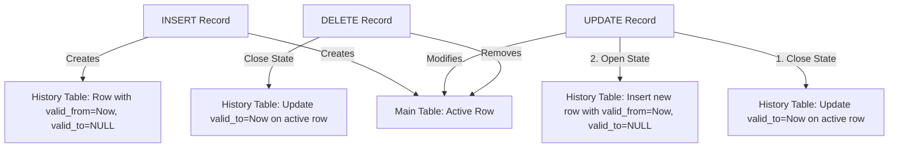

# Core Temporal Database Concepts

This guide explains the theoretical foundations of temporal databases and how they are implemented in this project.

---

## 1. Why Temporal Databases?
In a standard Relational Database (RDBMS), an update statement physically replaces old data with new data. 
*   **Limitation**: The database only remembers the state of data *now*. It cannot answer historical questions like:
    *   *What was John's salary in June 2024?*
    *   *Who was managing the Research department when Jane got her promotion?*
    *   *How many hours did Alice work on Project 1 during the month of May?*

A **Temporal Database** stores the timeline of changes, enabling you to query the state of data at any point in the past.

---

## 2. Temporal Dimensions
There are two primary time axes in database theory:

1.  **Valid Time (Real-World Time)**:
    *   The time interval during which a fact is true in the real world.
    *   *Example*: "John was employed in Department 5 from Jan 1, 2024, to May 1, 2024."
    *   *Control*: Usually managed by users or application logic (can be retroactive or proactive).
2.  **Transaction Time (System Time)**:
    *   The time interval during which a fact was stored in the database.
    *   *Example*: "John's department record was written to the database on Jan 3, 2024 at 14:32:00."
    *   *Control*: Managed exclusively by the system; it is immutable and cannot be backdated.

**Note**: This project implements a **Valid Time Temporal Database** using custom application-level logic via Spring Boot and history tables.

---

## 3. History Table Design
For every temporal entity (e.g., `employee`, `works_on`), there is a corresponding history table (e.g., `Employee_history`, `works_on_history`). 

### The Temporal Columns
The JAXB Schema Compiler injects three key metadata columns into every history table:
*   `valid_from`: The start timestamp of this specific data state.
*   `valid_to`: The end timestamp of this specific data state. A value of `NULL` represents the *active* state (currently valid, open-ended).
*   `tx_time`: The timestamp when this record was written (audit log).

### Primary Keys
Because a single entity (like Employee `123456789`) will have multiple rows in the history table (one for each version of their data), the base primary key (`ssn`) is not unique in the history table.
*   **Relational PK**: `ssn`
*   **Temporal PK**: `(history_id)` (Auto-incremented) or a composite key of `(ssn, valid_from)`.

---

## 4. State Transitions
The system maintains consistency between the main table (current state) and the history table (all states) during operations:



---

## 5. Interval Overlap (Temporal Joins)
To perform a temporal join between two historical timelines (e.g., matching a manager's work schedule with an employee's salary schedule), we calculate the overlap between their valid time intervals.

Two intervals `[A.start, A.end]` and `[B.start, B.end]` overlap if:
$$\text{A.start} < \text{B.end} \quad \text{AND} \quad \text{B.start} < \text{A.end}$$

In MySQL, open-ended intervals (`valid_to IS NULL`) are evaluated using `IFNULL(valid_to, '9999-12-31')` to represent infinity:
```sql
ON target.valid_from < IFNULL(cond.valid_to, '9999-12-31 23:59:59')
   AND cond.valid_from < IFNULL(target.valid_to, '9999-12-31 23:59:59')
```
This is the core mathematical logic driving the `executeTimeSlice` and `executeWhen` methods.
